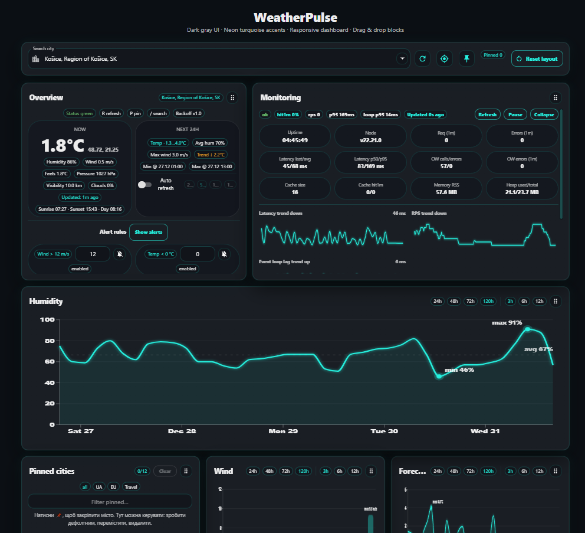

# 🌦️ WeatherPulse Dashboard



Shows **current weather + forecast charts** (OpenWeather) and a **monitoring panel** with extra metrics.

---

## ✨ Features

### 🌍 Weather UI
- 🔎 City search with autocomplete (geocoding)
- 🌡️ Current weather:
  - temperature (°C), feels-like (optional)
  - humidity (%)
  - wind speed + gusts (if available)
  - pressure, visibility, clouds (if available)
  - sunrise / sunset + day length (if available)
- 📌 Pinned cities:
  - pin / unpin
  - set default city
  - reorder pins (up/down)
  - group pins (UA / EU / Travel / custom)
  - per-pin mini preview (temp + wind) + “updated” age label
- ⌨️ Hotkeys:
  - `/` focus search
  - `R` refresh weather
  - `P` pin current city

### 📈 Charts (forecast)
- Temperature forecast line chart
- Humidity trend chart
- Wind chart
- Forecast range controls:
  - horizon: 24h / 48h / 72h / 120h
  - step: 3h / 6h / 12h sampling

### 🧩 Dashboard
- Drag & drop dashboard blocks (responsive grid)
- Resize / rearrange widgets (react-grid-layout)
- Persisted layouts per breakpoint
- “Reset layout” action to restore defaults

### 🛡️ Alerts (client-side rules)
- Rule types:
  - wind > threshold
  - temp < threshold
  - precip probability > threshold (if forecast pop available)
- LocalStorage persistence for rules + events

### 🛠️ Monitoring (server)
- requests / errors
- latency (avg / p50 / p95)
- cache hit rate
- event loop lag
- memory usage
- top routes / status codes

---

## 🧰 Tech Stack

### Client
- ⚛️ React + Vite
- 🎨 MUI (Material UI)
- 📊 D3.js charts
- 🧱 react-grid-layout (draggable / responsive dashboard)

### Server
- 🟩 Node.js + Express
- ☁️ OpenWeather API
- 🧠 in-memory cache + monitoring metrics API

---

## 📁 Project Structure

```txt
weatherpulse-dashboard/
  server/
    src/
      index.ts                 # Express API + OpenWeather calls + cache + monitoring metrics
    .env                       # OPENWEATHER_API_KEY (not committed)
    package.json               # server dependencies + scripts

  client/
    src/
      App.tsx                  # main UI + widgets + layouts/pins/city saved to LocalStorage
      main.tsx                 # React entry, ThemeProvider, global styles
      theme.ts                 # dark gray + neon turquoise MUI theme
      storage.ts               # LocalStorage helpers (selected city + layouts)
      api.ts                   # client API calls to server endpoints
      types.ts                 # shared types (GeoItem, ForecastPoint, alerts, etc.)
      rgl-overrides.css        # fixes RGL overflow/cropping in tiles

      components/
        GridDashboard.tsx      # react-grid-layout wrapper (responsive + width observer)
        WidgetCard.tsx         # styled draggable widget card + drag handle
        GlowCard.tsx           # neon-glow Paper card style
        TempLineChart.tsx      # D3 temperature forecast chart
        HumidityChart.tsx      # D3 humidity chart
        WindChart.tsx          # D3 wind chart
        MonitoringPanel.tsx    # monitoring UI (charts + metrics chips)
        MapWidget.tsx          # (optional) Leaflet map widget (if enabled)

      hooks/
        useHotkeys.ts          # hotkeys handler (/ R P)
        useAlerts.ts           # rules + events + desktop notifications

      utils/
        debounce.ts            # typed debounce helper (no any)

    package.json               # client dependencies + scripts

  docs/
    screenshots/
      dashboard-main.png
````

---

## ✅ Requirements

* Node.js **18+** (recommended)
* OpenWeather API key

---

## ⬇️ How to download from GitHub

```bash
git clone https://github.com/Antot-12/WeatherPulse-Dashboard.git
cd weatherpulse-dashboard
```

---

## 🔑 Setup Environment Variables

Create:

`server/.env`

```env
OPENWEATHER_API_KEY=your_key_here
PORT=3001
```

---

## ▶️ Run the project

### 1) Start the server (Terminal 1)

```bash
cd server
npm install
npm run dev
```

Server runs on: `http://localhost:3001`

### 2) Start the client (Terminal 2)

```bash
cd client
npm install
npm run dev
```

Client runs on: `http://localhost:5173`

---

## 🔌 API Endpoints

* `GET /api/geocode?q=Kyiv&limit=5`
* `GET /api/weather/current?lat=..&lon=..&units=metric`
* `GET /api/weather/forecast?lat=..&lon=..&units=metric`
* `GET /api/metrics`

---

## 💾 LocalStorage Keys (what is persisted)

* selected city
* pinned cities (+ default + groups)
* dashboard layouts per breakpoint
* alert rules + alert events
* (optional) other UI settings like auto-refresh

---

## 💡 Notes

* The dashboard layout is saved automatically after changes.
* Use **Reset layout** to restore default widget positions/sizes.
* Pinned cities support:

    * set default city (⭐)
    * reorder
    * quick load on click
* If desktop notifications are enabled, alerts can trigger OS-level notifications.

---