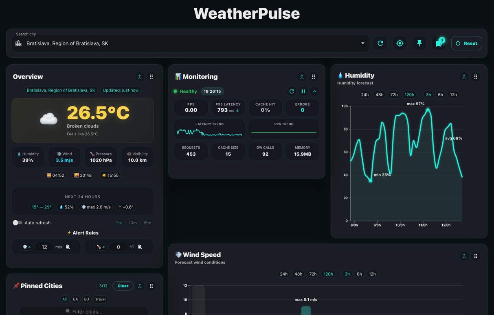
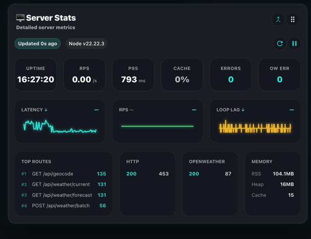

# 🌦️ WeatherPulse Dashboard

A modern, responsive weather dashboard with real-time forecasts, server monitoring, and customizable widgets.



---

## ✨ Features

### 🌍 Weather
- **City Search** - Autocomplete with geocoding
- **Current Weather** - Temperature, feels-like, humidity, wind, pressure, visibility, clouds, sunrise/sunset
- **Pinned Cities** - Save favorites, set default, group by category (UA/EU/Travel), mini previews with temp & wind
- **Keyboard Shortcuts** - `/` search, `R` refresh, `P` pin city

### 📈 Forecast Charts
- **Temperature** - Line chart with min/max markers, average line, day/night shading
- **Humidity** - Area chart with trend indicators
- **Wind Speed** - Bar chart with max wind label
- **Time Range Controls** - 24h / 48h / 72h / 120h horizon, 3h / 6h / 12h sampling

### 🧩 Dashboard
- **Drag & Drop** - Rearrange widgets freely
- **Resizable Widgets** - Resize from any edge or corner
- **Responsive Grid** - Adapts to screen size (xl/lg/md/sm/xs breakpoints)
- **Persistent Layouts** - Saved per breakpoint in LocalStorage
- **Reset Layout** - Restore default widget positions

### 🛡️ Alerts
- **Custom Rules** - Wind > threshold, Temp < threshold
- **Desktop Notifications** - OS-level alerts when triggered
- **Persistent** - Rules & events saved in LocalStorage

### 📊 Server Monitoring
- **Real-time Metrics** - RPS, latency (p50/p95), cache hit rate, errors
- **Sparkline Charts** - Latency trend, RPS trend, event loop lag
- **Resource Stats** - Memory usage, top routes, HTTP status codes

### 🖥️ Server Stats Panel
- **Detailed View** - Uptime, OpenWeather API calls, cache size
- **Status Breakdown** - HTTP & OpenWeather response codes
- **Memory Details** - RSS, heap used, heap total

---

## 🛠️ Tech Stack

| Layer | Technologies |
|-------|-------------|
| **Client** | React 18, Vite, TypeScript, MUI (Material UI), D3.js, react-grid-layout |
| **Server** | Node.js, Express, TypeScript |
| **API** | OpenWeather API (geocoding, current weather, forecast) |
| **Storage** | LocalStorage (client), In-memory cache (server) |

---

## 📁 Project Structure

```
WeatherPulse-Dashboard/
├── client/
│   ├── src/
│   │   ├── App.tsx                 # Main app with widgets & layouts
│   │   ├── main.tsx                # React entry point
│   │   ├── theme.ts                # Dark theme with neon accents
│   │   ├── api.ts                  # API client
│   │   ├── storage.ts              # LocalStorage helpers
│   │   ├── types.ts                # TypeScript types
│   │   ├── rgl-overrides.css       # Grid layout fixes
│   │   │
│   │   ├── components/
│   │   │   ├── GridDashboard.tsx   # Responsive grid wrapper
│   │   │   ├── WidgetCard.tsx      # Draggable widget container
│   │   │   ├── GlowCard.tsx        # Neon glow card style
│   │   │   ├── TempLineChart.tsx   # Temperature D3 chart
│   │   │   ├── HumidityChart.tsx   # Humidity D3 chart
│   │   │   ├── WindChart.tsx       # Wind D3 chart
│   │   │   ├── MonitoringPanel.tsx # Compact monitoring widget
│   │   │   ├── ServerStatsPanel.tsx# Detailed server stats
│   │   │   └── ...
│   │   │
│   │   ├── hooks/
│   │   │   ├── useHotkeys.ts       # Keyboard shortcuts
│   │   │   └── useAlerts.ts        # Alert rules & notifications
│   │   │
│   │   └── utils/
│   │       └── debounce.ts         # Debounce helper
│   │
│   └── package.json
│
├── server/
│   ├── src/
│   │   └── index.ts                # Express API + caching + metrics
│   ├── .env                        # Environment variables
│   └── package.json
│
├── docs/
│   └── screenshots/
│
├── .gitignore
└── README.md
```

---

## ⚙️ Requirements

- **Node.js** 18+ (recommended)
- **OpenWeather API Key** - [Get one free](https://openweathermap.org/api)

---

## 🚀 Quick Start

### 1. Clone the repository

```bash
git clone https://github.com/Antot-12/WeatherPulse-Dashboard.git
cd WeatherPulse-Dashboard
```

### 2. Configure environment

Create `server/.env`:

```env
OPENWEATHER_API_KEY=your_api_key_here
PORT=3001
```

### 3. Start the server

```bash
cd server
npm install
npm run dev
```

Server runs at: `http://localhost:3001`

### 4. Start the client

```bash
cd client
npm install
npm run dev
```

Client runs at: `http://localhost:5173`

---

## 🔌 API Endpoints

| Endpoint | Description |
|----------|-------------|
| `GET /api/geocode?q=Kyiv&limit=5` | City search with autocomplete |
| `GET /api/weather/current?lat=..&lon=..&units=metric` | Current weather data |
| `GET /api/weather/forecast?lat=..&lon=..&units=metric` | 5-day forecast (3h intervals) |
| `POST /api/weather/batch` | Batch weather for multiple cities |
| `GET /api/metrics` | Server monitoring metrics |

---

## 💾 Data Persistence

All user preferences are stored in LocalStorage:

- Selected city
- Pinned cities (with groups & default)
- Dashboard layouts (per breakpoint)
- Alert rules & history
- Widget combinations
- Auto-refresh settings

---

## ⌨️ Keyboard Shortcuts

| Key | Action |
|-----|--------|
| `/` | Focus search input |
| `R` | Refresh weather data |
| `P` | Pin/unpin current city |

---

## 🎨 Customization

### Theme
The app uses a dark theme with neon turquoise accents. Colors can be modified in `client/src/theme.ts`.

### Default Layout
Widget default positions and sizes are defined in `DEFAULT_LAYOUTS` in `client/src/App.tsx`.

### Alert Rules
Custom alert thresholds can be configured in the Alert Rules section of the Overview widget.

---

## 📸 Screenshots

### Main Dashboard


---
